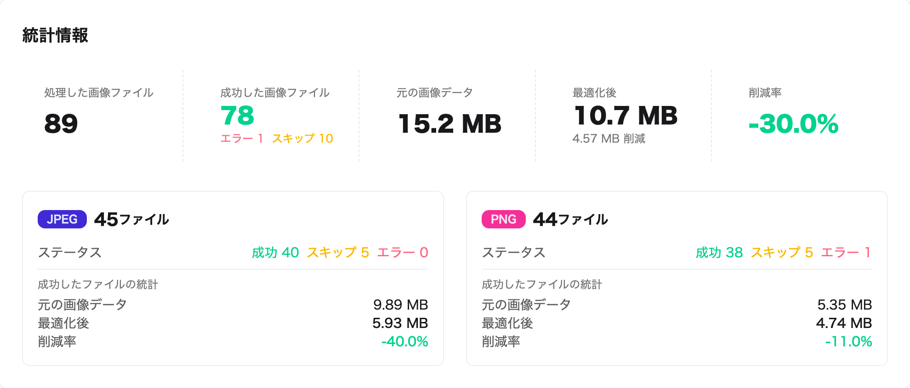
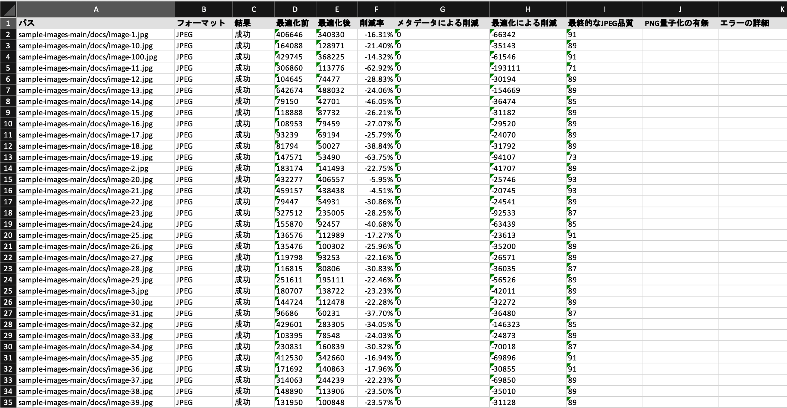

## 画像最適化は「疑われやすい」作業

「画像を軽くしてほしい」という依頼を受けて作業したのに、「本当にやったの？」と疑われた経験はありませんか？あるいは逆に、依頼したものの本当に最適化されたのか確認できず、疑ってしまった経験はありませんか？

一生懸命作業したのに疑われるのは悲しいことですし、依頼した側も確認できないのはもどかしいものです。

画像最適化は見た目では分かりにくい作業です。適切な最適化であれば画質に変化はなく、ファイルサイズの違いも一枚一枚プロパティを確認しないと分かりません。つまり、**やったかどうかがパッと見では判断できない**のが画像最適化という作業。確認する側もどう確認していいのか分からないのです。

結果として「やりました」「本当に？」という**言葉だけのやり取り**になりがちで、お互いの信頼関係を損ねる原因にもなります。

## LightFile Selfなら最適化の「証拠」を出せる

この問題を解決するのが、無料の画像最適化サービス「LightFile Self」です。

<ProductLink
  code="lightfile-self"
  title="LightFile Self"
  description="無料の画像最適化サービス。会員登録不要で、最適化結果のExcelレポートも出力可能。"
  url="https://self.lightfile.net/"
/>

LightFile Selfの最大の特徴は、**最適化結果を詳細にレポートできること**。まず、処理完了後に全体の統計情報が表示されます。

処理したファイル数、成功・スキップ・エラーの内訳、元のデータ量と最適化後のデータ量、そして**全体の削減率**が一目で分かります。この例では89ファイルを処理し、15.2MBから10.7MBへと**30%の削減**を達成しています。

さらに、**1ファイルごとの詳細レポートをExcelファイルでダウンロード**できます。

各ファイルについて、パス、フォーマット、最適化前後のサイズ、削減率、どのような処理を施したかが記録されています。このレポートがあれば、「このファイルは30%軽量化、このファイルは50%軽量化」と**具体的な数字で説明**できます。クライアントや上司に対して、**作業の証拠（エビデンス）を提示**できるわけです。

## 使い方は簡単、300MBまでのZIPに対応

使い方はとてもシンプルです。

1. 最適化したい画像をZIPファイルにまとめる
2. LightFile Selfのサイトにアップロード
3. 最適化された画像（ZIP）とExcelレポートをダウンロード

対応しているZIPファイルは**最大300MBまで**。中小規模のウェブサイトであれば、**サイト全体の画像を丸ごと最適化**することも可能です。**会員登録は不要**で、個人・商用問わず**無料**で利用できます。

最適化されたZIPファイルは元のフォルダ階層を維持しているので、そのままサーバーにアップロードすれば入れ替え完了。手間をかけずに画像の一括最適化ができます。

## 結果とプロセスを「見える化」する価値

画像最適化は、やって当たり前、できて当然という扱いをされがちです。しかし、実際には専門的な知識と手間が必要な作業です。

その努力を正当に評価してもらうためには、**結果とプロセスの「見える化」** が欠かせません。LightFile Selfが出力する統計情報とExcelレポートは、まさにその見える化を実現するツールです。

**数字という客観的な証拠**があれば、依頼した側も安心できますし、作業した側も自信を持って報告できます。お互いの信頼関係を無駄に損なうことなく、スムーズに仕事を進められるようになるでしょう。

画像最適化で「疑われる」ストレスから解放されたい方は、ぜひLightFile Selfを試してみてください。

<ProductLink
  code="lightfile-self"
  title="LightFile Self"
  description="無料の画像最適化サービス。会員登録不要で、最適化結果のExcelレポートも出力可能。"
  url="https://self.lightfile.net/"
/>
