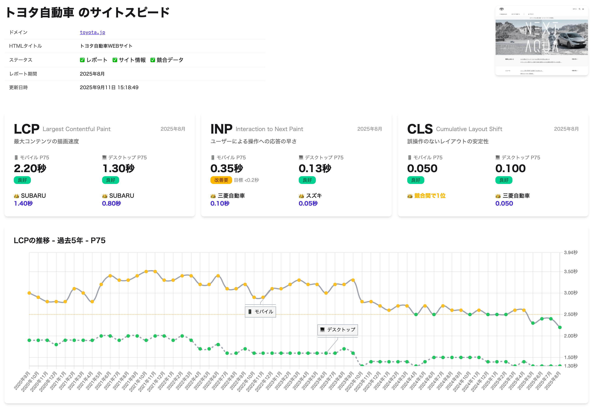
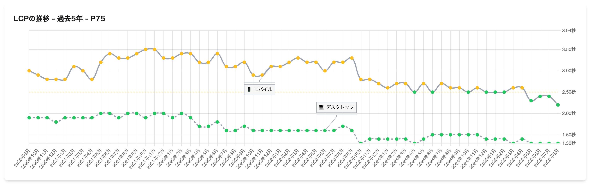
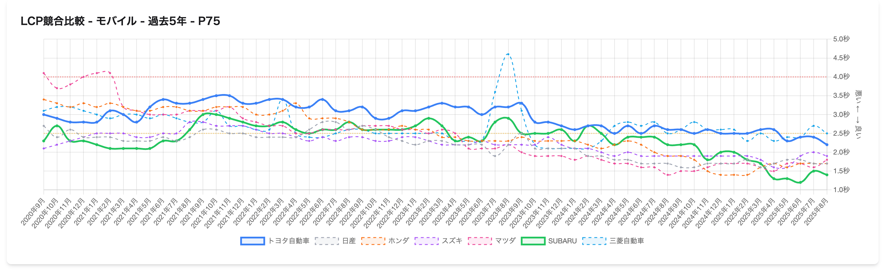

「うちのサイト、なんか遅くなった気がする」「リニューアルしたのに速くなった実感がない」「競合と比べてどうなんだろう」──こんなモヤモヤを抱えていませんか？

サイトスピードに関する不安や疑問は、多くのWebマスターや経営者が抱えるものです。しかし、その「遅い気がする」という感覚は、果たして正確なのでしょうか。

## 自分一人の体感でサイトスピードを判断するのは危険

**自分一人の体感でサイトスピードを判断するのは、実はとても危険なことです。**

その日のネットワーク状況、使っているデバイス、ブラウザのキャッシュ状態──さまざまな要因で体感速度は変わります。昨日は遅く感じたのに今日は速い、ということも珍しくありません。

さらに厄介なのは、**体感は「気分」にも左右される**という点です。忙しいときは何でも遅く感じますし、余裕があるときは同じ速度でも気にならない。こうした不正確な情報を元に「うちのサイトは遅い」と決めつけてしまうと、必要のない改修に予算を使ったり、逆に本当に必要な改善を見逃したりする原因になります。

大切なのは、**客観的な数値で事実を確認し、そこから次のアクションを考えること**。では、その客観的なデータはどこにあるのでしょうか。

## Googleが記録している「世界中のユーザー体験」

実は、うってつけのデータが存在します。それが **Chrome User Experience Report（CrUX）** です。

CrUXは、GoogleがChromeブラウザを通じて世界中のユーザーから収集している、あらゆるWebサイトの体感スピードデータです。どのくらいの速度でページが表示されたか、統計的に保存されており、**誰でもアクセスできるように公開されています**。

つまり、皆さんがモヤモヤする必要はないのです。一人の体感に頼らない、**世界中のユーザーにおける客観的な体感スピード**を、Googleがちゃんと記録してくれています。

ただし、CrUXデータへのアクセスにはBigQueryを使う必要があるなど、技術的なハードルが高いのが難点でした。

## サイトスピード クロニクルなら、URLを入れるだけ

<ProductLink
  code="sitespeed-chronicle"
  title="サイトスピード クロニクル"
  description="CrUXデータを活用した無料のCore Web Vitals比較ツール。5年間の推移と競合比較が可能。"
  url="https://chronicle.sitespeed.info/"
/>

そこでお勧めしたいのが「サイトスピード クロニクル」です。

このツールを使えば、**URLを入力するだけ**で、CrUXデータに基づいた客観的なサイトスピード分析が可能になります。しかも**完全無料**です。

たとえば、トヨタ自動車（toyota.jp）のレポートを見てみましょう。日本一の企業ということで、題材として使わせていただきました。

Core Web Vitalsの各指標（LCP、INP、CLS）について、現在のパフォーマンスが一目でわかります。

## 5年間の推移で「本当に遅くなったか」がわかる

「昔に比べて遅くなった気がする」という疑問にも、このツールは答えてくれます。

**5年間にわたるパフォーマンスの推移**がグラフで表示されるため、本当に遅くなっているのか、それとも気のせいなのかが、客観的な数値で確認できます。

また、**リニューアル前後の効果測定**にも最適です。「大金をかけてリニューアルしたのに、速くなった実感がない」というケースでも、このグラフを見れば、リニューアル前後でパフォーマンスがどう変化したかが一目瞭然。投資に見合った成果が出ているのか、客観的に評価できます。

体感ではなくデータで判断できる──**これがモヤモヤを解消する第一歩です**。

## AIが競合サイトを自動選定して比較

「競合と比べてどうなんだろう」という疑問にも対応しています。

サイトスピード クロニクルでは、**AIが類似サイトを自動で選定**し、競合との相対比較を行います。自社サイトが業界内でどのような位置にいるのか、一目で把握できます。

「遅い気がする」ではなく「競合の中で○番目」という**具体的な順位**で現状を理解できる。これも、体感では絶対に得られない情報です。

## サイトスピード改善の最初の一歩として

サイトスピードに関するモヤモヤを抱えているなら、**まずは客観的なデータを確認することから始めましょう**。

自分の体感だけでモヤモヤするのではなく、CrUXという世界中のユーザーデータに基づいて、正確な現状把握をする。そこから初めて、次の正確な判断ができるようになります。

サイトスピード クロニクルは、そのための最初の一歩として最適なツールです。URLを入力するだけで、5年間の推移も競合比較も、すべて無料で確認できます。

ぜひ一度、あなたのサイトのレポートを確認してみてください。

<ProductLink
  code="sitespeed-chronicle"
  title="サイトスピード クロニクル"
  description="URLを入力するだけで、5年間の推移と競合比較を無料で確認。サイトスピード改善の第一歩に。"
  url="https://chronicle.sitespeed.info/"
/>
