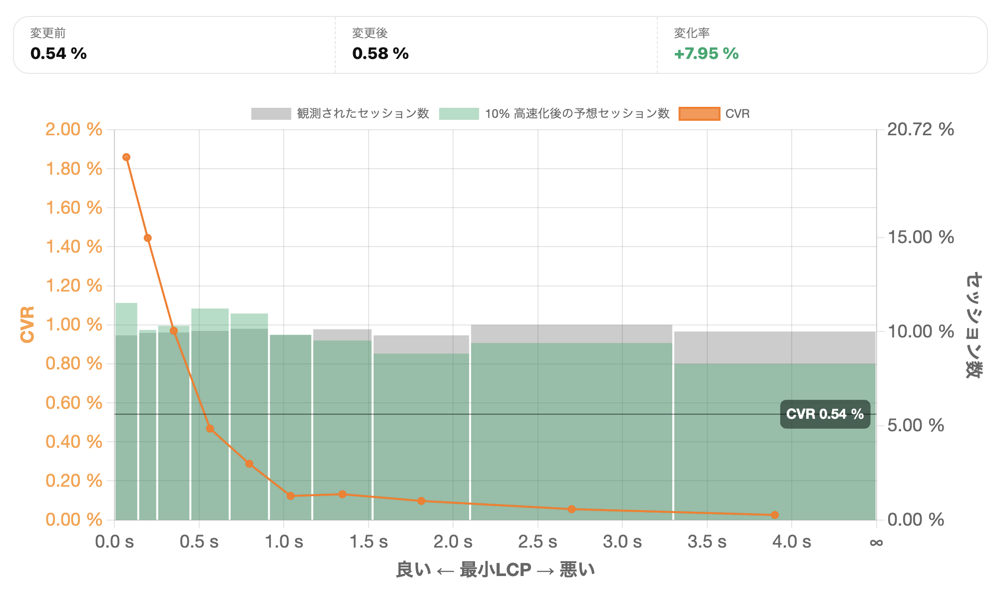

「表示速度が0.1秒遅くなると、コンバージョン率が何%下がる」──このようなフレーズを目にしたことはありませんか？

サイトスピードの改善を提案する際、こうした海外事例がよく引き合いに出されます。それを根拠にサイトスピード改善を提案する会社も実際に存在します。

感覚的には「速いほうがいい」「遅いと離脱される」と理解できる。でも、**サイトスピードが速くなったことで売上が上がったという実体験をした方、あるいはそのようなデータを手元に有している方は、実はほとんどいません。**

## なぜ投資判断が難しいのか

サイトスピードの改善には、それなりのコストがかかります。

インフラの見直し、画像の最適化、コードのリファクタリング。見積もりを取れば数十万円から数百万円という金額が出てくることも珍しくありません。

ところが、**その投資が「いくらのリターンを生むのか」を説明できる人はほとんどいません。**

経営層に「サイトを速くしたい」と提案しても、「で、いくら儲かるの？」と聞かれたら答えに詰まる。だからプロジェクト化できない。現場で問題意識があっても、予算を確保できない。そんな経験はないでしょうか。

## 博打か、それとも論理的な投資か

時折、権限のある経営者が「サイトが遅い、なんとかしろ」と号令をかけ、トップダウンでプロジェクトが動き出すことがあります。

この場合、**成果の見積もりもなく「エイヤー」で始まることが多い。** 言わば博打のようなものです。

うまくいけば結果オーライ。でも、もし成果が出なければ「やっぱりサイトスピードって関係ないんじゃないか」という空気になり、以後の改善提案がさらに通りにくくなる。

サイトスピードの改善は、本当にそんな博打でしか始められないものなのでしょうか。

## 見えないものを見えるようにする

**実は、サイトスピード改善の成果は事前に見積もることができます。**

必要なのは、二つのデータです。一つは、**ユーザーが実際に体験しているサイトの表示速度**。もう一つは、**そのユーザーがコンバージョンしたかどうか**。

この二つを紐づけて観測し、速度とコンバージョン率の関係性を定量的にモデル化する。そうすれば、「現状よりも10%速くなったら、コンバージョン率がどれくらい改善するか」を論理的に予測できるようになります。

たとえば、サイトスピード改善の見積もりが100万円だったとします。その100万円がペイするかどうかを、事前のデータ分析で判断できるとしたら。博打ではなく、根拠のある投資判断ができるとしたら。

## 予測のための専用ツール

サイトの表示速度とコンバージョンの関係に特化したアクセス解析ツールが「Speed is Money」です。

計測タグを設置し、コンバージョンページを設定するだけ。実際のユーザーが体験している速度と、そのユーザーの行動を紐づけて分析し、サイトスピード改善によってどれくらいの収益増が見込めるかを可視化します。

GA4でも同様の分析は理論上可能ですが、カスタム設定や専用レポートの開発に数週間かかることも。Speed is Moneyなら、タグを設置するだけで専用の分析レポートがすぐに使えます。

## あなたのサイトでは、速度と売上の関係は見えていますか

サイトスピードの改善を「やってみないとわからない」ものから、**「事前に見積もれる投資」に変える。**

それだけで、プロジェクトの通し方も、社内の説得の仕方も変わってきます。

もし今、サイトの表示速度に課題を感じているなら、まずは自社サイトにおける速度と収益の関係を数字で把握することから始めてみてはいかがでしょうか。見えなかったものが見えるようになるだけで、次の一歩が見えてくるかもしれません。

<ProductLink
  code="speedismoney"
  title="Speed is Money"
  description="サイトスピードと収益の関係を可視化する無料アクセス解析ツール。高速化による収益増を事前に見積もり、投資判断を支援します。"
  url="https://speedis.money/"
/>
