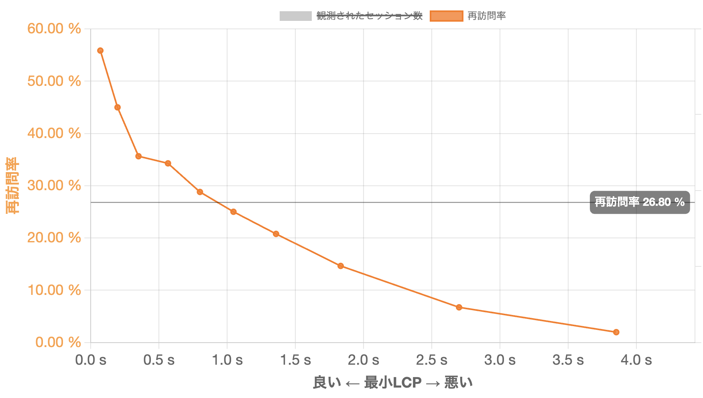
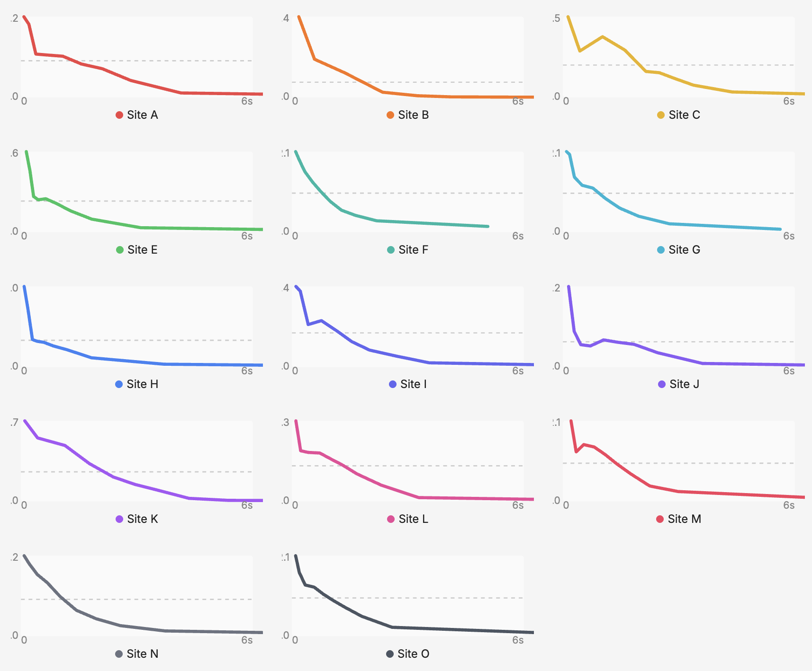

通販サイトにとって、一度購入してくれたお客様に「もう一度来てもらう」ことは、新規顧客を獲得することと同じくらい重要です。いや、むしろそれ以上かもしれません。

## 通販サイトにおけるLTVの重要性

通販ビジネスでは、LTV（ライフタイムバリュー＝顧客生涯価値）という考え方が重視されています。広告費をかけて新規顧客を獲得しても、一度きりの購入で終わってしまっては投資回収が難しい。何度もサイトを訪れ、繰り返し購入してくれるファンを育てることこそが、通販ビジネスの本質といえます。

そのファンづくりの最初のステップが「再訪問」です。サイトにもう一度来てもらえなければ、リピート購入もファン化もありません。

## LCPと再訪問率の衝撃的な関係

ここで、あるECサイトで計測したデータをご覧ください。LCPと再訪問率の関係を示したグラフです。

LCP（Largest Contentful Paint）とは、Core Web Vitalsに含まれるサイトスピードの代表的な指標の一つです。ページのメインコンテンツが表示されるまでの時間を測り、ユーザーが「ページが表示された」と感じるタイミングを表します。

グラフの傾向は明らかです。**LCPが良好なユーザーの再訪問率は約55%。** しかし、**LCPが悪くなるにつれて再訪問率は急激に低下し、LCPが4秒になると約2%にまで落ち込みます。**

なお、このグラフで使っているのは「最小LCP」、つまりそのユーザーがサイト内で体験した中で最も速かったLCPです。最小LCPが悪いということは、そのユーザーは一度も快適な表示体験ができなかったことを意味します。逆に言えば、少なくとも一度は快適な体験ができたユーザーは、55%という高い再訪問率を示しています。

## 14サイトすべてで同じ傾向

「たまたまそのサイトだけでは？」と思われるかもしれません。

Speed is Moneyでは、協力いただいた14の通販サイトのデータを分析しました。

**すべてのサイトで、LCPが悪くなるほど再訪問率が下がるという同じ傾向が確認されました。** サイトの規模や扱う商品ジャンルに関わらず、この法則は普遍的に成り立っています。

ここでいう「再訪問率」とは、複数の日にまたがってサイトを訪れたユーザーの割合です。同じ日に何度もアクセスした場合はカウントせず、「わざわざ別の日にもう一度来てくれた」かどうかを測定しています。

## ファンを失うという長期的リスク

サイトスピードの問題というと、「今回のセッションでコンバージョンするかどうか」という短期的な視点で語られがちです。しかし、**真のリスクはもっと深刻です。**

たまたまネットワーク環境や端末の状態が悪く、遅い体験ばかりを強いられたユーザーは、そのサイトに戻ってこなくなる。これは一回の売上を失うという話ではありません。**将来にわたって得られたはずのLTV全体を失っているのです。**

サイト全体の平均速度が「まあまあ」だったとしても、一部のユーザーには常に遅い体験を強いている可能性があります。そしてそのユーザーたちは、静かにサイトを去り、二度と戻ってこない。この「見えない流出」こそが、サイトスピード問題の本質的なリスクです。

## 遅さが「また来たい」気持ちを打ち消す

一部のユーザーは商品やブランドに魅力を感じて、「また来たい」という気持ちを本来持っています。しかし、**遅さがその気持ちを打ち消してしまう**のです。

表示が遅くてストレスを感じると、「あのサイト、なんか遅かったな」という印象が残り、次に買い物をしようと思ったとき無意識にそのサイトを避けるようになる。本来あったはずの「また来たい」という気持ちが、遅さによって打ち消されてしまうのです。

通販サイトの高速化は、今日の売上を上げるためだけの施策ではありません。お客様が本来持っている「また来たい」という気持ちを打ち消さない──それがLTVを最大化するための基盤なのです。

## 自社サイトのLCPと再訪問率を確認する

この記事で紹介したようなLCPと再訪問率の関係は、自社サイトでも確認できます。弊社が無料で提供している「Speed is Money」を使えば、サイトスピードと再訪問率の関係を可視化し、リピーター獲得における課題を把握できます。

<ProductLink
  code="speedismoney"
  title="Speed is Money"
  description="サイトスピードと収益の関係を可視化する無料アクセス解析ツール。計測タグを設置するだけで、LCPと再訪問率の関係をすぐに確認できます。"
  url="https://speedis.money/"
/>
