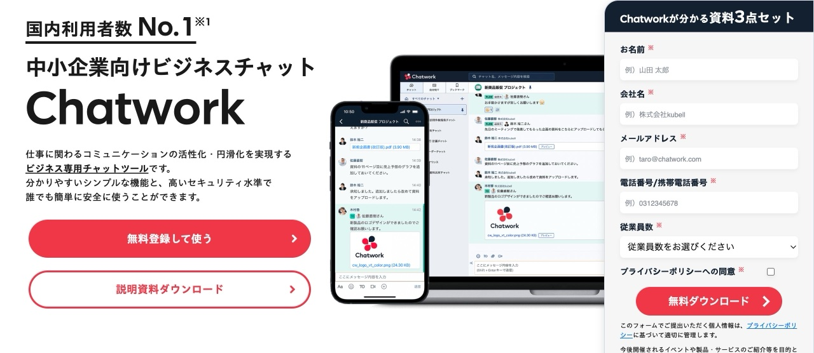
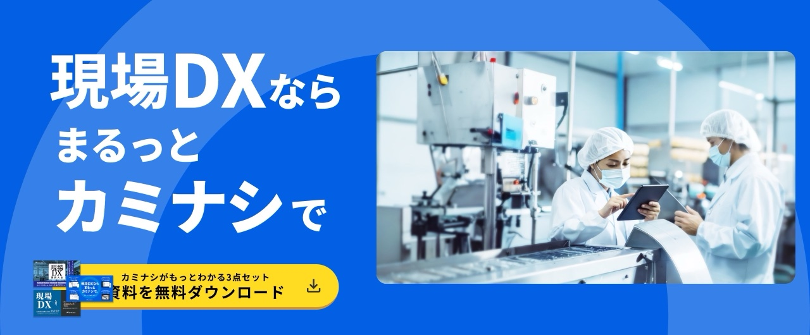
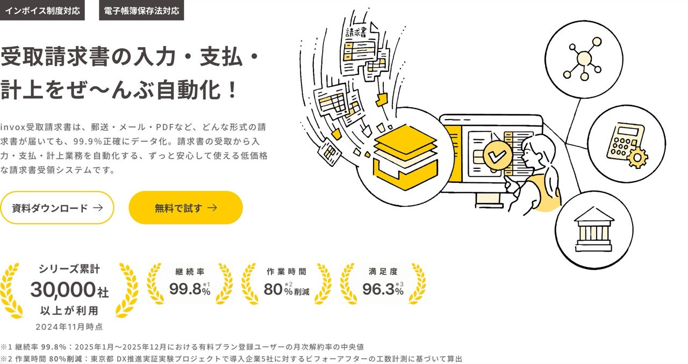
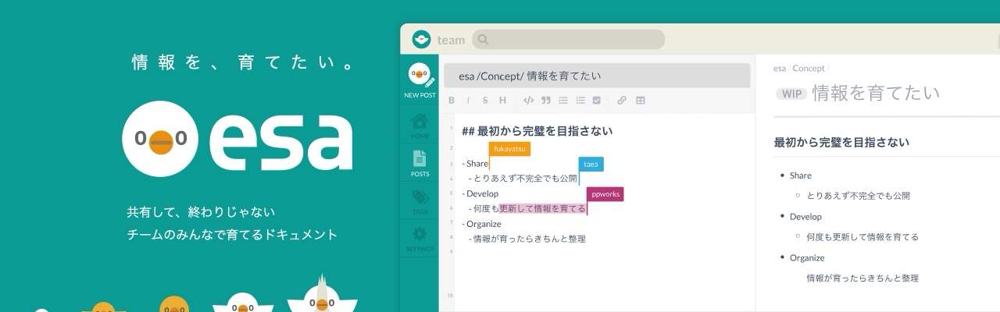
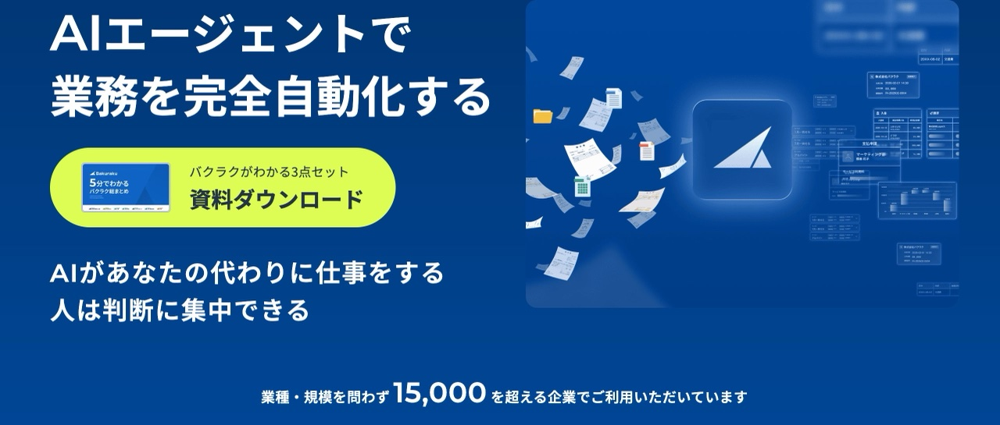

B2Bのサービスサイトを眺めていると、ヒーローに書かれた言葉がやけに気になる瞬間があります。「なぜここはこの言葉を選んだのだろう」という素朴な疑問です。

それを調べてみようと思い立ち、国内外のB2B SaaS 62サイトのヒーロー見出し（h1）を集めて分類してみました。すると、思いのほかきれいに5つのパターンに整理されることがわかりました。

## まずキャッチコピーに何を込めるかという問いから

トップページに訪れる人はどんな情報を求めているのでしょうか。

「このサービスは何か」「信頼できるか」「自分たちの問題を解決できるか」。これらを瞬時に伝えるのがヒーローの役割だとすれば、何を最初に伝えるかで戦略がまったく変わってきます。

数字なのか、カテゴリなのか、課題なのか、ビジョンなのか。62サイトを分類した結果、その答えは5つに分かれていました。

## 5つのパターン

### 数値訴求型（15サイト/22%）

最も多かったのが数字を前面に出すパターンです。「No.1」「導入XX社」「0円」のような具体的な数値で信頼感と実績を示します。

Chatworkの「国内利用者数No.1」、Salesforceの「世界No.1 AI CRM」、Airレジの「0円でカンタンに使える」といった例が代表的です。

数字は最も即座に伝わる情報です。「すごい」「安い」「多い」を説明なしに伝えられます。特に導入社数は、BtoBにおける「他社も使っている」という安心感に直結します。

### カテゴリ定義型（14サイト/21%）

「〜システム」「〜プラットフォーム」のように、サービスのカテゴリを明示するパターンです。COMPANYの「大手法人向け統合人事システム」、カミナシの「現場DXプラットフォーム」などが該当します。

このパターンはSEOとの相性がとくによいのが特徴です。ユーザーが検索する言葉と一致しやすく、サービスの役割が一言で伝わります。「自分たちが探しているのはこれだ」と判断させる速度が速くなります。

### 課題解決型（13サイト/19%）

「自動化」「効率化」「一元化」など、ユーザーの抱える課題に直接応えるパターンです。invoxの「受取請求書の入力・支払・計上をぜ〜んぶ自動化！」、楽楽精算の「毎月の経費精算業務、脱・紙Excelで効率化」などが代表例です。

課題を言語化すると「自分のことを言っている」という共感が生まれます。「会計担当が毎月悩んでいるあの面倒くさい作業」を言語化できれば、読んだ人は自然と引き込まれます。

### ブランドメッセージ型（10サイト/15%）

ビジョンや世界観をそのまま宣言するパターンです。kintoneの「みんな、つくれる。」、esaの「情報を、育てたい。」、Slackの「チームの知恵が集まる場所」がわかりやすい例です。

機能や数字ではなく、サービスが目指す世界を語ります。このパターンは「この会社の考え方に共感する」という感情的な繋がりを生みます。選んだ理由を他者に語りやすくなるという効果もあります。

### 機能・価値直接訴求型（11サイト/16%）

AI・技術の具体的な価値を前面に出すパターンです。バクラクの「AIエージェントで業務を完全自動化する」、ClickUpの「Unlimited AI Agents」がその典型です。

課題解決型と似ていますが、課題よりも「何でできるか」「どんな技術か」に重点があります。AIが急増した2026年においては、このパターンが急速に広がっています。

## 上位3パターンで6割超、そしてAIの急増

数値訴求型、カテゴリ定義型、課題解決型の3パターンで全体の62%を占めていました。この3つに共通するのは「わかりやすさ」です。説明なしに理解できる、そのわかりやすさを多くのB2B SaaSが選んでいます。

もう一つ見えてきたのが、AI訴求の急増です。今回調査した62サイトのうち、ヒーローに「AI」という言葉を含むサイトが12サイト以上ありました。2年前であれば考えにくかった数です。機能・価値直接訴求型が台頭しているのは、AIという言葉の説得力が高まっていることと無関係ではないでしょう。

## キャッチコピーは「誰に何を信じてもらうか」の選択

5つのパターンを並べると、それぞれに込められた意図が見えてきます。

数値訴求は「実績を信じてほしい」、カテゴリ定義は「探している人に正確に届きたい」、課題解決は「あなたの悩みを理解している」、ブランドメッセージは「この価値観に共感してほしい」、機能・価値直接訴求は「この技術でできることを見てほしい」という意図です。

あなたのサービスは、訪れた人に何を最初に信じてもらいたいでしょうか。その問いに向き合うことが、キャッチコピー選びの出発点になるはずです。

---

<ProductLink
  code="b2b-top-research"
  title="B2Bトップページ研究 — 設計の定石"
  description="62サイトのキャッチコピー全文と分類結果、パターンごとの実践的なアドバイスを掲載しています。"
  url="https://b2b-top.whitepapers.ideamans.com/"
/>
