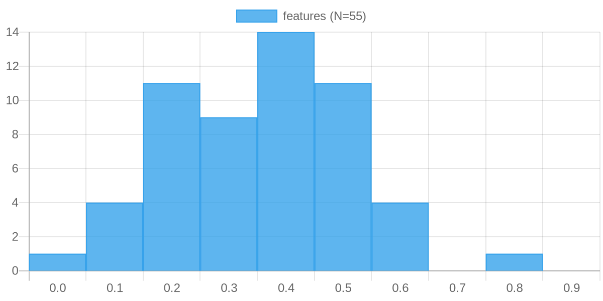
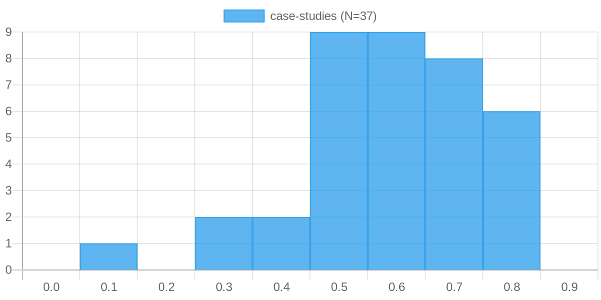
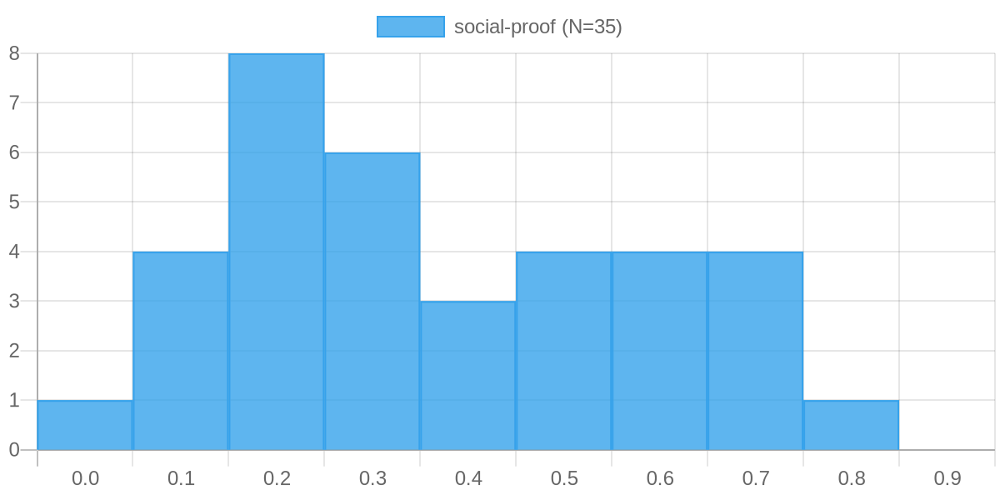

B2Bサービスのトップページを作るとき、「何をどの順番で並べるか」で悩んだことはありませんか。

ヒーローセクションの次に機能紹介を置くべきか、それとも課題解決から入るべきか。料金は上のほうに出したほうがいいのか、後半に置くべきなのか。こういった問いに答えてくれるデータがあるとしたら、参考になるのではないでしょうか。

今回は62サイトのB2Bトップページを分析し、各セクションが「ページ全体のどの位置に配置されているか」を調べた結果から見えてきた「典型的な配置順序」をご紹介します。

## ページの位置を0〜1で表すと何が見えるか

分析では、各セクションの上端がページ全体の高さに対してどの割合の位置にあるかを0（最上部）から1（最下部）で表しました。62サイト分のデータを集め、それぞれのセクション種別ごとに中央値を算出しています。

結果として浮かび上がってきたのは、B2Bトップページが4つのフェーズに自然に分かれているという事実でした。

## 前半はとにかく「何のサービスか」を伝える

最初のフェーズはページ上部0〜20%の範囲です。ここに集中しているのはヒーローセクション（0.00）、サービス概要（0.17）、価値提案（0.18）の3つでした。

これは当たり前のように見えて、実は重要な示唆を含んでいます。訪問者はページを開いた瞬間に「このサービスが自分に関係あるかどうか」を判断しようとします。そのための情報が、これら3つのセクションにすべて詰め込まれているわけです。

では、ここを通過した読者の次の問いは何でしょうか。「関係ありそうだ。でも、なぜこれを選ぶべきなのか」という問いです。

## 中盤で「なぜこのサービスか」を説得する

20〜50%の範囲には、説得のためのセクションが密集していました。課題解決（0.22）から始まり、製品ラインナップ（0.29）、選ばれる理由（0.37）、導入実績（0.38）、機能紹介（0.42）、そして料金（0.44）と続きます。

この並びには、一定の論理的な流れがあります。まず「あなたの課題に対応できます」と伝え、「具体的にはこういうプロダクトがあります」と見せ、「選ばれている実績があります」と証明し、「機能の詳細はこうです」と根拠を示し、「費用感はこれくらいです」と現実的な検討を促します。

ここで興味深いのが、信頼を示す2つのセクションの使われ方です。

機能紹介はページの42%付近に安定して配置される傾向があり、標準偏差も小さくなっています。一方、同じ「信頼」を示すためのコンテンツでも、導入実績（数値による実績）は前半に、導入事例（ストーリーによる実績）は後半に置かれていました。

なぜこのような違いが生まれるのでしょうか。数値は短く直感的に伝わりますが、事例はある程度の読み込みを必要とします。検討初期の読者には数値が刺さり、検討が進んでいる読者には事例が刺さります。ページの構造が、読者の検討プロセスに自然に対応しているのです。

## 後半は「具体的なイメージ」と「不安の払拭」

50〜80%の範囲では、トーンが変わります。活用シーン（0.50）、導入の流れ（0.59）、導入事例（0.64）、サポート（0.71）、お役立ち資料（0.79）と続くこのフェーズは、「具体化と安心感の提供」というテーマで統一されています。

導入事例はページ後半に集中して配置される傾向がありました。前半で数値としての実績を示したあと、後半では「実際に使ったら自社はどうなるか」をイメージさせるための事例が登場します。

また「導入の流れ」や「サポート」が後半に配置されているのも示唆的です。これらのセクションは、前向きになっている読者が「でも手間じゃないか」「困ったときはどうするんだ」という不安を感じ始めたときに答えを与えるための情報です。

「選ばれる理由」を示す導入実績はページ前半に集まる一方、「具体的な体験談」としての導入事例は後半に分散して配置されています。この対比が、B2Bトップページの設計思想をよく表していると感じました。

## 最後に行動を促す

80〜100%の範囲には、FAQ（0.82）、セミナー案内（0.82）、お知らせ（0.90）が続き、CTA（コール・トゥ・アクション）は末尾（1.00）の中央値でした。

ただしCTAに関しては、末尾だけに限定しているサイトは少なく、多くのサイトでは中盤にも配置していました。データ上の平均配置回数は1.3回です。「十分に説得したあと最後に行動を促す」という基本を維持しながら、途中で関心の高まった読者の離脱を防ぐ配慮がうかがえます。

---

あなたが担当しているB2Bサービスのトップページは、このフローに近い構成になっているでしょうか。それとも、どこかのフェーズが欠けていたり、順番が入れ替わっていたりするでしょうか。

データが示す「典型的な配置順序」が唯一の正解ではありません。しかし、多くのサイトが自然に辿り着いたこの設計には、訪問者の思考プロセスに寄り添う理由があります。自社のトップページを見直すときの、一つの視点として役立てていただければ幸いです。

---

<ProductLink
  code="b2b-top-research"
  title="B2Bトップページ研究 — 設計の定石"
  description="各セクションの配置位置ヒストグラムや、パターン別のセクション構成フローも詳しく解説しています。"
  url="https://b2b-top.whitepapers.ideamans.com/"
/>
