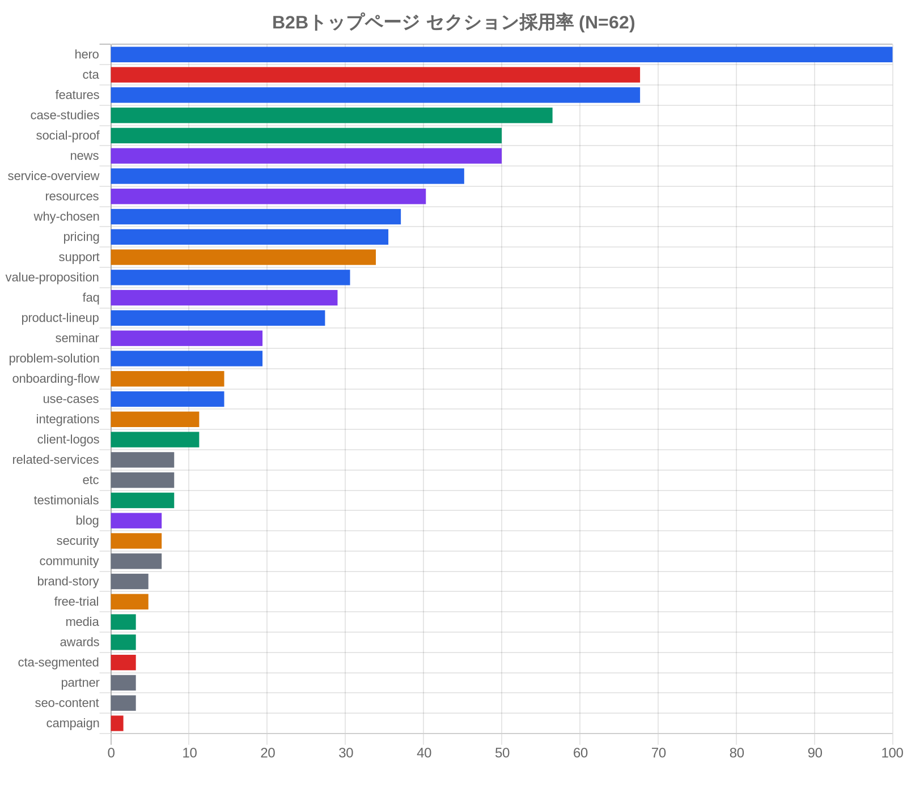

B2Bサービスのトップページには、さまざまなセクションが並んでいます。ヒーロー画像、機能紹介、導入事例、料金プラン……どれを入れるべきかは、リニューアルのたびに議論になりがちなテーマです。そこで今回は、実際に62サイトのB2Bトップページを調査し、各セクションがどの割合で採用されているかをランキング形式でまとめました。

## 採用率で見るセクションの序列

調査結果を可視化したグラフがこちらです。

採用率を見ると、セクションは大きく3つの層に分かれることがわかりました。

| 層 | 採用率の目安 | 代表セクション |
|----|------------|--------------|
| 必須 | 50%以上 | ヒーロー、機能紹介、CTA、導入事例、導入実績、お知らせ |
| 準必須 | 30〜50% | サービス概要、お役立ち資料、選ばれる理由、料金プランなど |
| 選択的 | 10〜30% | FAQ、製品ラインナップ、セミナー、課題解決など |

それぞれの層でどんなセクションが含まれるのか、もう少し詳しく見ていきましょう。

## 上位6セクションがB2Bトップページの骨格を作る

採用率50%以上、すなわち「必須」と呼べる層には6つのセクションが入りました。

- **ヒーロー** 100%
- **機能紹介** 68%
- **CTA（行動喚起）** 68%
- **導入事例** 57%
- **導入実績** 50%
- **お知らせ** 50%

ヒーローが100%なのは当然として、注目したいのは機能紹介とCTAが同率で2位に並んでいることです。B2Bのトップページは「どんなサービスなのかを伝え、次の行動を促す」という役割が中心になっています。それがこの数字にそのまま表れています。

導入事例と導入実績も半数以上が採用しています。B2Bでは意思決定に時間がかかるため、「他社がうまくいっている」という証拠を示すことが重要視されています。この2つがそろって骨格の一部を担っているのは、BtoBマーケティングの王道といえます。

## 準必須セクションには戦略の違いが出やすい

採用率30〜50%の「準必須」層には、個性が出やすいセクションが並びます。

- **サービス概要** 45%
- **お役立ち資料** 40%
- **選ばれる理由** 37%
- **料金プラン** 36%
- **サポート体制** 34%
- **価値提案** 31%

「サービス概要」と「価値提案」が別々に計上されているのは、実際のページ構成を見ると理解しやすくなります。サービス概要はどんな機能や仕組みかを説明するもの、価値提案は「あなたにとってどんな価値があるか」を伝えるもので、役割が分かれているサイトが多くありました。

料金プランの採用率が36%というのは、感覚よりも低く感じるかもしれません。B2Bでは価格を公開しないケースや、問い合わせベースで個別見積もりを行うケースも多いため、この数字には納得感があります。

## 選択的セクションは差別化のための上乗せ

採用率10〜30%の「選択的」層は、各社が自社のサービス特性に合わせて加えるセクションです。

- **FAQ** 29%
- **製品ラインナップ** 27%
- **セミナー** 19%
- **課題解決** 19%
- **活用シーン** 15%
- **導入の流れ** 15%

FAQや製品ラインナップは比較的汎用性が高いですが、セミナーや活用シーンは業種・サービスによって効果が変わります。これらは「あったほうがいい」ではなく、自社のマーケティング戦略に照らして判断するセクションといえます。

## 日本のB2Bならではの傾向も見えてきた

調査全体を通じてひとつ気になったのが、「お知らせ」と「お役立ち資料」の採用率の高さです。

お知らせは採用率50%で必須層に入り、お役立ち資料は40%で準必須層に位置しています。欧米のB2BサイトではNewsやBlogをトップページに常設するケースはそれほど多くありませんが、日本のサイトではトップページのフッター付近に「最新情報」を並べる慣習が根強く残っています。

お役立ち資料はホワイトペーパーや資料ダウンロードのことで、リード獲得施策の一環として設置するサイトが多くあります。日本のB2Bマーケティングでは資料ダウンロードがコンバージョンポイントとして重視されているため、トップページへの露出が高くなっていると考えられます。

---

<ProductLink
  code="b2b-top-research"
  title="B2Bトップページ研究 — 設計の定石"
  description="各セクションの採用率だけでなく、配置位置のヒストグラムやスクリーンショット付きの実例集も収録しています。"
  url="https://b2b-top.whitepapers.ideamans.com/"
/>
