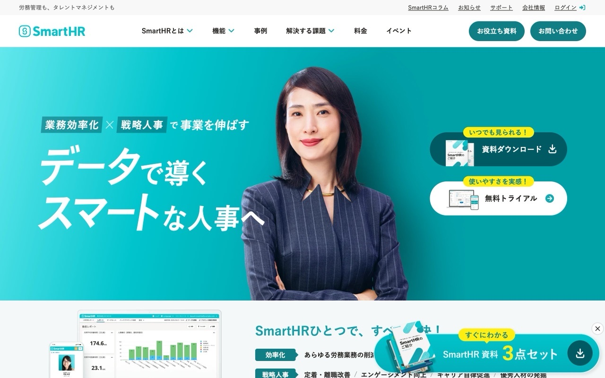
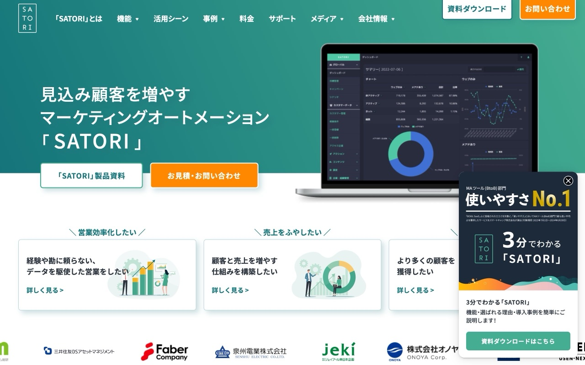
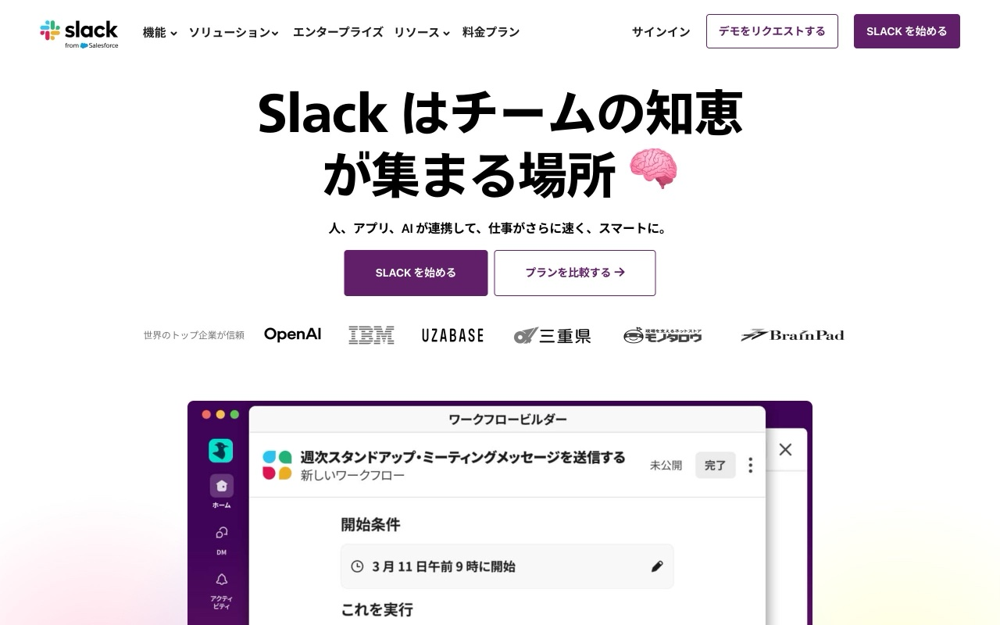
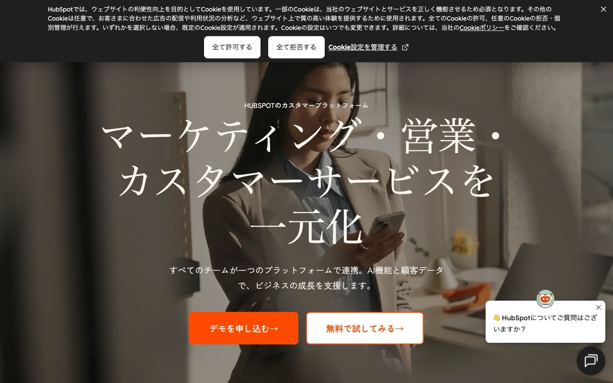

B2BサービスのWebサイトを見回すと、なんとなく似た構成のページが多いと感じたことはありませんか。それを実際にデータで確かめようとしたところ、面白い結果が出ました。60サイトを分析したら、きれいに6つのパターンに分類できたのです。

## セクション構成を「文字列」に変換して比較する

分析に使ったアプローチが少し変わっています。

まず、対象サイトのトップページを上から順にスキャンして、各セクションに「ヒーロー」「機能紹介」「導入実績」「料金」「CTA」といったタグを付けていきます。その並び順をそのまま文字列として記録します。たとえば「ヒーロー→概要→機能→事例→CTA」というセクション構成は、一続きの文字列として扱えます。

次に、2サイトの文字列がどれだけ似ているかを「正規化レーベンシュタイン距離」で計算します。レーベンシュタイン距離とは、ある文字列を別の文字列に変換するために必要な最小操作数を表す指標です。セクションを1つ追加する、削除する、入れ替える、といった操作の回数が少ないほど似ているとみなされます。

この距離を全サイトのペアで計算し、「似ているものは近くに、違うものは遠くに」配置する階層的クラスタリングをかけると、6つのグループが浮かび上がってきました。

## 6つのパターンを見ていく

### パターン1: 王道フルスペック型（22サイト、37%）

もっとも多かったのがこのパターンです。SmartHR、freee、楽楽精算をはじめとする国産SaaSが多く該当しています。

平均セクション数は10.2と全パターン中でも多く、ヒーロー → サービス概要 → 機能紹介 → 導入事例 → サポート → お役立ち資料 → ニュース → CTAという流れが典型的です。ページを下にスクロールするにつれて、製品のあらゆる側面を順序よく見せていく設計になっています。

国産SaaSにこのパターンが多い背景には、日本の購買文化があると考えられます。稟議を通すために情報を揃えたい、信頼できる会社かを確認したいというニーズに応えようとすると、必然的にページが充実していきます。

### パターン2: 価値提案・CTA直行型（22サイト、37%）

同率で並んだのがこのパターンで、SlackやHubSpot、Asanaといったグローバル製品に多く見られました。

平均セクション数は8.4と比較的少なく、コンテンツマーケティング系のセクション（お役立ち資料やブログ誘導など）をバッサリ省略しています。ヒーローで価値提案を明確に伝えたら、機能や実績を手短に示してすぐにCTAへ誘導します。無駄をなくした最短ルートです。

グローバル製品がこちらに集まる理由は、意思決定プロセスの違いにありそうです。欧米では担当者が自分でサインアップして試用し、気に入ったら社内展開するボトムアップ型が一般的です。そのため「まず使ってみてほしい」というメッセージを前面に出す構成になりやすくなっています。

### パターン3: 網羅フルコース型

セクション数が最も多く、20を超えることもある充実型です。製品の機能・料金・事例・サポート・パートナー情報・ニュースなど、考えられる情報をほぼすべて盛り込んでいます。複雑な製品で購買検討に時間がかかる業種や、BtoBtoC型のサービスで多様なステークホルダーに訴求する必要があるケースに多く見られます。

### パターン4: 実績訴求・多機能型

導入実績や受賞歴、メディア掲載情報を目立つ位置に配置するパターンです。「すでに多くの企業が使っている」という社会的証明を冒頭から前面に打ち出し、信頼構築を優先します。競争が激しいカテゴリや、後発サービスがシェアを広げようとしている局面で有効な戦略に見えます。

### パターン5: 料金・比較検討促進型

料金プランのページ遷移へのリンクや、競合との比較表を上位のセクションに置くのが特徴です。「他と比べてほしい」「価格で迷わせたくない」という意図が構成に表れています。価格競争力や機能対価格比を強みとしているサービスに多く見られました。

### パターン6: コミュニティ・ブランド型

コミュニティへの参加訴求や、ブランドの世界観・思想を伝えるコンテンツが多いパターンです。製品の機能よりも「どんな会社か」「どんな人たちが使っているか」を伝えることに重きを置いています。オープンソース系のサービスや、強いブランドを持つ老舗企業に見られました。

## 国産とグローバルが対称的に分かれた

今回の分析でもっとも印象的だったのは、パターン1とパターン2が同率1位（各22サイト、37%）を占め、かつ国産とグローバルで見事に分かれた点です。

パターン1（王道フルスペック型）に多い日本固有のセクションとして「お役立ち資料」と「お知らせ・ニュース」があります。これらはコンテンツマーケティングの成果物を見せる場所として機能しており、購買前の情報収集を重視する日本の商習慣と深く結びついています。

一方、パターン2（価値提案・CTA直行型）のグローバル製品はこれらをほとんど持っていません。代わりに「試す」「始める」への誘導を短いステップで完結させています。

どちらが優れているという話ではありません。ターゲット顧客の購買行動に合わせた結果として、構成が最適化されていると考えるのが自然です。自社サービスがどのパターンに属しているかを知ることで、「自分たちはどの購買行動に合わせようとしているか」という戦略の問い直しにもなります。

---

<ProductLink
  code="b2b-top-research"
  title="B2Bトップページ研究 — 設計の定石"
  description="6つのパターンそれぞれに該当するサイト一覧と代表的なスクリーンショットを収録。自社に合うパターンを見つけてください。"
  url="https://b2b-top.whitepapers.ideamans.com/"
/>
