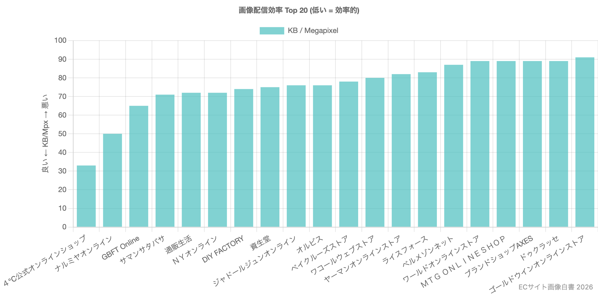
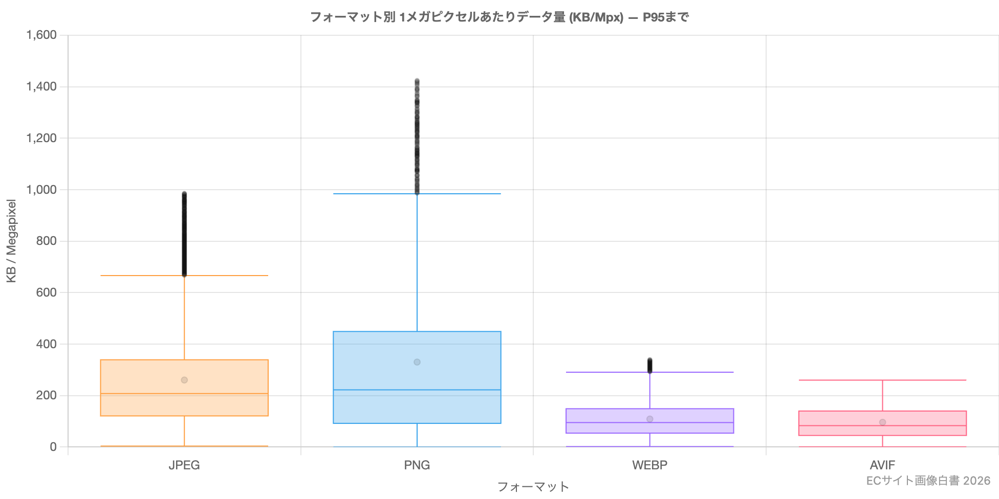
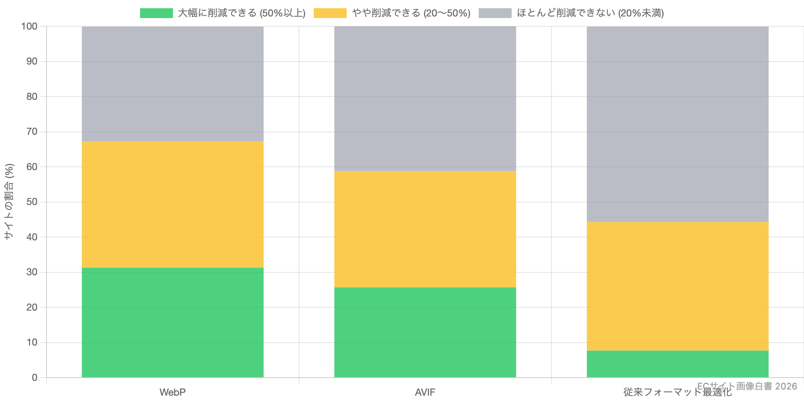
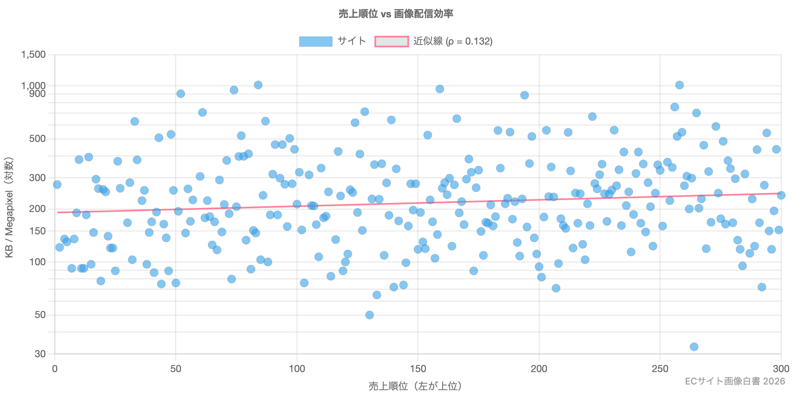
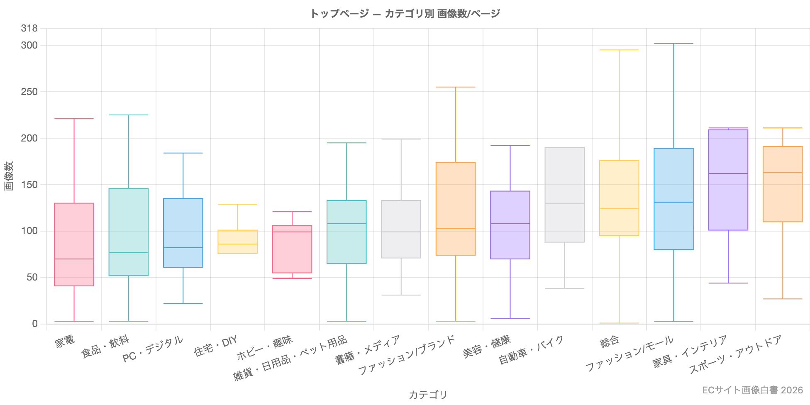
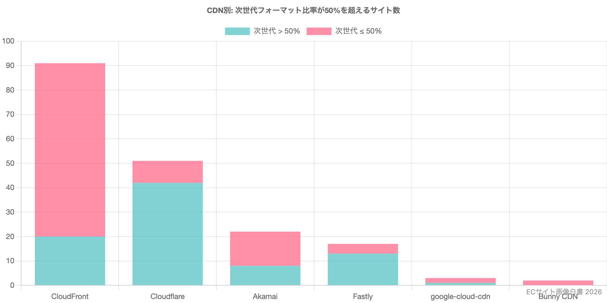

「うちのサイトの画像は重いのか、軽いのか」。ECサイトを運営していると、一度はそう気になったことがあるのではないでしょうか。しかし、画像が重い・軽いという議論は感覚的に語られることが多く、定量的な比較データに基づいて判断するのは容易ではありません。

弊社では、ネット通販売上上位300社の自社ECサイトを対象に、画像データの使われ方を横断的に調査・分析した「**ECサイト画像白書 2026**」を無料公開しました。自社サイトの画像は業界の中でどのような位置にあるのか、どのくらい改善の余地があるのか。感覚ではなくデータに基づいて判断するための資料として、ぜひご活用ください。

<ProductLink
  code="ec-image-whitepaper-2026"
  title="ECサイト画像白書 2026"
  description="ネット通販売上上位300社の自社ECサイトを対象に、画像配信効率・次世代フォーマット採用率・最適化ポテンシャル・CDN活用状況を定量分析した無料の調査レポートです。"
  url="https://ec-image-2026.whitepapers.ideamans.com/"
/>

## 調査の概要

通販新聞社「第25回ネット販売白書」に掲載されたネット販売売上上位300社のうち、独自ドメインによる自社公式ECサイトを運営している284サイトを対象としています。サイトごとにトップページ・商品一覧・商品詳細の計5ページをクロールし、約1,500ページ・約10万枚の画像を分析しました。

レポートでは、以下の5つのテーマで分析しています。

1. **画像配信効率** — 1メガピクセルあたり何KBで画像を届けているか
2. **画像配信ボリューム** — 1ページあたりの画像数と平均解像度
3. **次世代フォーマット** — WebP・AVIFの採用率
4. **最適化ポテンシャル** — WebP/AVIF変換による削減余地のシミュレーション
5. **CDNによる画像配信** — CDNの種類と次世代フォーマット利用率の関係

## 画像配信効率ランキング — 画像の扱いが上手なサイトはどこか

レポートの目玉のひとつが「画像配信効率」のランキングです。画像1メガピクセル（1,000×1,000ピクセル相当）を届けるのに何KBのデータを要するかを示す独自指標で、値が低いほど効率的に画像を配信できていることを意味します。

上位サイトは40〜90 KB/Mpx程度と、非常に効率的な配信を実現しています。

## WebP・AVIFはJPEGの半分以下のデータ量

フォーマット別に1メガピクセルあたりのデータ量を比較すると、次世代フォーマットの効果の大きさが見えてきます。JPEGの中央値が約200 KB/Mpxであるのに対し、WebPは約100 KB/Mpx、AVIFも同程度。実際のECサイト284サイトのデータでも、次世代フォーマットは従来フォーマットの約半分のデータ量で配信できていることが確認されています。

## 約3割のサイトで画像データを半分以下にできる

では、実際にどのくらいの改善余地があるのか。従来フォーマットの画像をWebPに変換するシミュレーションを行ったところ、**約31%のサイト（284サイト中約90サイト）で50%以上の削減が可能**という結果でした。さらに20〜50%の削減が見込めるサイトを合わせると、全体の約67%で意味のある削減効果が得られます。

まだまだECサイトの画像最適化には、大きな改善余地が残されています。

## 売上規模と画像最適化は現状ほぼ無関係

意外かもしれませんが、売上順位と画像配信効率の間に統計的に有意な相関は認められませんでした。大企業だから画像最適化への投資が進んでいるとは言えない状況です。

裏を返せば、規模の小さなサイトでもすでに適切な対策を講じているところがあるということ。画像最適化のチャンスは、サイトの規模に関係なく平等に開かれています。

## 商材カテゴリで画像の使い方は大きく異なる

レポートでは、商材カテゴリごとの分析も多数掲載しています。たとえば家具・インテリアやファッションといった「見せる」ことが重要な商材では、トップページだけで中央値が130〜160枚もの画像を使用。書籍・メディアやホビーでは60〜100枚程度にとどまります。

このように商材カテゴリごとの定量的な基準値が見えてくるのも、本レポートの特徴です。自社サイトの画像枚数やデータ量が、同じカテゴリの中で多いのか少ないのかを客観的に判断する指標として活用できます。

## CDNではCloudflareの次世代フォーマット活用が顕著

CDN別の分析では、導入サイト数ではAWS CloudFrontが最多（約91サイト）ですが、次世代フォーマット比率が50%を超えるサイトは約20サイト。一方、Cloudflareでは約51サイト中約42サイトで次世代フォーマット比率が50%を超えています。Cloudflareが標準で提供する画像最適化機能「Polish」の影響が大きいと推測されます。

CDN選定や画像配信戦略を検討する際にも、参考になるデータではないでしょうか。

## レポートの活用法

すべてのチャートにはワンクリックでのキャプチャ・ダウンロード機能を搭載しています。自社サイトの現状把握、改善施策の優先度判断、社内外のステークホルダーへの説明資料として、ぜひご活用ください。

<ProductLink
  code="ec-image-whitepaper-2026"
  title="ECサイト画像白書 2026"
  description="ネット通販売上上位300社の自社ECサイトを対象に、画像配信効率・次世代フォーマット採用率・最適化ポテンシャル・CDN活用状況を定量分析した無料の調査レポートです。"
  url="https://ec-image-2026.whitepapers.ideamans.com/"
/>

---

自社サイトの画像がどの程度軽量化できるかを把握するなら、URLを入力するだけで診断できる無料ツールもあります。白書のデータと合わせて、自社の立ち位置を確認してみてはいかがでしょうか。

<ProductLink
  code="lightfile-simulator"
  title="画像最適化無料診断"
  description="URLを入力するだけで、画像最適化の効果を約1分で診断。WebPやAVIFへの変換効果、トラフィック削減量、CDNコスト削減額まで無料でレポートします。"
  url="https://simulator.lightfile.net/"
/>

AWS CloudFrontで画像を配信しているなら、設定変更だけでWebP自動変換を導入できるLightFile Proxyもご検討ください。白書で明らかになったCloudFrontサイトの次世代フォーマット課題を解決する手段のひとつです。

<ProductLink
  code="lightfile-proxy"
  title="LightFile Proxy"
  description="CloudFrontのオリジンとして設定するだけで、画像を自動的にWebP形式に変換して配信。プログラムやHTMLの変更不要で、データ転送料金を約35%削減します。"
  url="https://www.lightfile-proxy.net/"
/>
